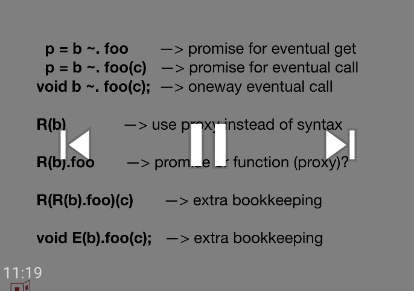

# proposal-wavy-dot

## Pleasant Notation for Promise Pipelining

by Mark S. Miller (@erights), Chip Morningstar (@FUDCo), and Michael FIG (@michaelfig)

## Status

Presented to TC39 (Javascript standards committee), achieving stage 1.

[](https://www.youtube.com/watch?v=ikyK3hUJsN8&list=PLzDw4TTug5O0ywHrOz4VevVTYr6Kj_KtW)

## Summary

This is a follow on proposal to [proposal-eventual-send](https://github.com/Agoric/proposal-eventual-send), providing syntactic sugar for the APIs of that proposal.

The 2011 [ECMAScript strawman concurrency
proposal](https://web.archive.org/web/20161026162206/http://wiki.ecmascript.org/doku.php?id=strawman:concurrency)
also described a simple desugaring of an infix bang (*!*) operator to
support promise pipelining. To avoid conflict with TypeScript, this proposal
instead introduces the wavy dot (*~.*) syntax.


### Wavy Dot

Like the (*?.*) of the [optional chaining proposal](https://tc39.es/proposal-optional-chaining/), wavy dot (*~.*) is a proposed infix operator with the same precedence as dot (*.*). Both can be understood as *adjective dot*, i.e., an operation that is dot-like, but differs according to the adjective. Once the optional chaining proposal is accepted, we will add to this proposal an operator combining the two adjectives, such as (*?~.*) or (*~?.*).

When the wavy dot expression occurs in a syntactic context in which the value of the expression might be used, the syntax has the following equivalences

| Syntax | Internal Method |
| --- | --- |
| `p ~. name` | `p.[[GetSend]]('name')` |
| `p ~. name = value` | `p.[[SetSend]]('name', value)` |
| `delete p ~. name` | `p.[[DeleteSend]]('name')` |
| `p ~. (...args)` | `p.[[ApplySend]](args)` |
| `p ~. name(...args)` | `p.[[ApplyMethodSend]]('name', args)`|
| &nbsp; | &nbsp; |
| `p ~. [prop]` | `p.[[GetSend]](prop)` |
| `p ~. [prop] = value` | `p.[[SetSend]](prop, value)` |
| `delete p ~. [prop]` | `p.[[DeleteSend]](prop)` |
| `p ~. [prop](...args)` | `p.[[ApplyMethodSend]](prop, args)`|

When the expression occurs in a syntactic context where the value of the expression is obviously ignored, such as an *ExpressionStatement*, the equivalences are as above, but using the [[\*SendOnly]] variant of these internal methods.

### Proposed Syntax

Abstract Syntax:

```
 Expression : ...
      Expression ~. [ Expression ] Arguments    // eventual post
      Expression ~. Arguments                   // eventual post
      Expression ~. [ Expression ]              // eventual get
      Expression ~. [ Expression ] = Expression // eventual put
      delete Expression ~. [ Expression ]       // eventual delete
```

Attempted Concrete Syntax, where "..." signifies the existing productions of that non-terminal. Our intention is that this syntax follow the pattern of the [optional chaining proposal](https://tc39.es/proposal-optional-chaining/).

```
  WavyDot ::
      ~. [lookahead ∉ DecimalDigit]

  MemberExpression : ...
      MemberExpression WavyDot [ Expression ]
      MemberExpression WavyDot IdentifierName
  CallExpression : ...
      CallExpression WavyDot [ Expression ] Arguments
      CallExpression WavyDot IdentifierName Arguments
      MemberExpression WavyDot Arguments
      CallExpression WavyDot Arguments
      CallExpression WavyDot [ Expression ]
      CallExpression WavyDot IdentifierName
  UnaryExpression : ...
      delete CallExpression WavyDot [ Expression ]
      delete CallExpression WavyDot IdentifierName
  LeftHandSideExpression :
      Identifier
      CallExpression [ Expression ]
      CallExpression . IdentifierName
      CallExpression WavyDot [ Expression ]
      CallExpression WavyDot IdentifierName
```

# Prototype

A [Babel playground](https://babeljs.io/repl/build/11698/#?babili=false&browsers=&build=&builtIns=false&spec=false&loose=false&code_lz=B4PwdADgFAngNAAgF6II4EoBQowG0CWAurIkljicueFFgGYDcmmd24EbeRnECAvAgBunAoX5DMAEwCmAG2kAXaQhwcZ8pSvCjmOTAgQcA9EYQA5APYIAhgFcFFgLbWF-AMYIAztMfuLsiwA7BHxA7wAnVyCwXQN9BCMAKgQ6CytE03ZME3MrOwdnVw9vXzd_IJCw6Uj8aMwgA&debug=false&forceAllTransforms=false&shippedProposals=false&circleciRepo=&evaluate=false&fileSize=false&timeTravel=false&sourceType=module&lineWrap=true&presets=es2015%2Creact%2Cstage-2&prettier=false&targets=&version=7.6.2%2Bpr.10115&externalPlugins=babel-plugin-syntax-eventual-send%407.6.2) implements this proposal using static methods on the `HandledPromise` object that is in the current scope.  The [Work-In-Progress Babel pull request for this syntax](https://github.com/babel/babel/pull/10115) is also available.
